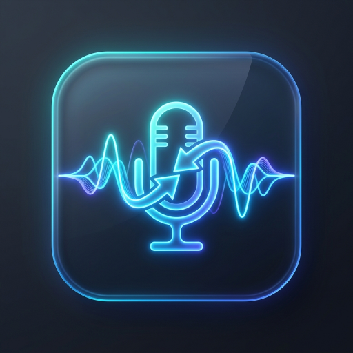

# 🎙️ PolySub (多语实时同传字幕)

<p align="center">
  
</p>

<p align="center">
  <strong>专为网课听讲、国际会议与外语观影打造的 Windows 影院级实时双语同传悬浮字幕工具</strong>
</p>

<p align="center">
  <a href="https://github.com/ounc/PolySub/releases"></a>
  <a href="LICENSE"></a>
  <a href="#"></a>
  <a href="#"></a>
</p>

---

## ✨ 核心特性

- 🎬 **影院级沉浸式字幕 (LiveCaptions-Translator 交互模式)**
  - **平时零干扰**：控制栏默认自动隐藏，仅呈现大号清晰字幕。
  - **鼠标悬停呼出**：鼠标移入时平滑展开控制栏，移出自动收起；支持 `📌` 图钉一键固定常驻。
  - **立体文字阴影**：内置硬件加速 `QGraphicsDropShadowEffect` 描边与轮廓阴影，在任何复杂视频画面或纯白网页上均清晰可读。
  - **动态自适应尺寸**：长短句换行毫秒级自动伸缩高度，告别文字截断与大面积死区。

- 🪟 **双轨语音听写引擎 (Dual ASR Sources)**
  - **系统原生轨 (Windows 11 实时字幕)**：通过 UI Automation 抓取系统底层字幕，**0% 独占麦克风、绝不锁麦**，内存占用极低（几十 MB）。
  - **AI 离线轨 (SenseVoice 本地大模型)**：基于达摩院 FunASR 离线神经网络，直接采集中英文语音，100% 离线保护隐私。
  - **防冲突自动愈合**：智能检测并纠正被第三方工具移至屏幕外的系统字幕，双软件交替使用绝不冲突。

- 🔀 **四大双语排版模式**
  - `🇨🇳 中文置顶 (ZH_TOP)`：中文大字在上，英文在下（推荐同传听讲）。
  - `🇬🇧 英文置顶 (EN_TOP)`：英文大字在上，中文在下（外语精听磨耳朵）。
  - `🇨🇳 纯中文 (ZH_ONLY)`：纯净电影字幕。
  - `🇬🇧 纯英文 (EN_ONLY)`：原声无翻译。

- 🌐 **全矩阵多翻译引擎无缝容灾**
  - **Google / MyMemory**：开箱即用、永久免配置、自动多线路轮换。
  - **DeepL API**：官方专业开发者级翻译精准度。
  - **Ollama**：纯离线本地大语言模型（如 Qwen2.5）。
  - **OpenAI 兼容端点**：支持 SiliconFlow（硅基流动）等各种云端大模型。

- 📜 **本地历史转写与对话自动持久化 (Local Transcripts)**
  - 每日全量双语对话流按日期自动归档至 `transcripts/` 目录。
  - 内置历史记录回溯面板，支持按日期回放、实时关键词过滤检索与快速复制。

- ⚡ **毫秒级极速秒开优化**
  - 离线大模型组件惰性加载，软件启动速度提升 200+ 倍（**0.2 秒瞬间呼出**）。

---

## 🖥️ 悬浮窗控制栏示意

```text
+-----------------------------------------------------------------------------------------------------------------------+
| [ 239 ms ] [⚡ Google] [⏸️ 暂停] [🪟 系统字幕 ▾] [🔀 英➔中 ▾]  📌 [🔀 排版 ▾] [📑 2条 ▾] [🔤 大小 ▾] [🎨 颜色 ▾] [📜] [⚙️] [✕] |
| (平时自动隐藏，鼠标悬停展开，右键任意位置呼出全功能菜单)                                                                 |
+-----------------------------------------------------------------------------------------------------------------------+
| 🇨🇳 中文大号高对比度字幕 (支持主题配色与 0%~100% 透明度调节)                                                           |
| 🇬🇧 English subtitle transcript with crisp drop shadows                                                                |
+-----------------------------------------------------------------------------------------------------------------------+
```

---

## 🚀 快速上手 (Quick Start)

### 环境要求
- **操作系统**：Windows 11（推荐，自带实时字幕最佳）或 Windows 10
- **Python**：Python 3.10 及以上版本

### 1. 克隆或下载本仓库
```bash
git clone https://github.com/ounc/PolySub.git
cd PolySub
```

### 2. 创建虚拟环境并安装依赖
```bash
python -m venv .venv
.venv\Scripts\activate
pip install -r requirements.txt
```

> 💡 **提示**：如果仅使用 **Windows 11 实时字幕** 听写来源（推荐，轻量不锁麦），无需安装 `torch` 和 `funasr` 即可秒速运行。

### 3. 初始化配置文件
首次运行可直接执行目录下的 `启动同传.bat`，脚本会自动从 `setting.example.json` 复制生成 `setting.json`。

### 4. 启动程序
双击 `启动同传.bat`，或在命令行执行：
```bash
pythonw app.pyw
```

---

## 🛠️ 配置说明 (`setting.json`)

在二级设置界面（点击 `⚙️ 设置`）或直接编辑 `setting.json`：

| 配置项 | 说明 | 推荐值 |
| :--- | :--- | :--- |
| `AsrSource` | 语音听写来源：`LiveCaptions`（系统字幕）/ `SenseVoice`（AI模型） | `"LiveCaptions"` |
| `ApiName` | 首选翻译引擎：`Google` / `DeepL` / `Ollama` / `OpenAI` | `"Google"` |
| `TransDirection`| 翻译方向：`EN_TO_ZH`（英译中）/ `ZH_TO_EN`（中译英） | `"EN_TO_ZH"` |
| `CaptionLayout` | 字幕排版：`ZH_TOP` / `EN_TOP` / `ZH_ONLY` / `EN_ONLY` | `"ZH_TOP"` |
| `AlwaysShowToolbar`| 是否常驻控制栏：`false`（悬停显示）/ `true`（始终常驻） | `false` |

---

## 📜 开源许可与致谢 (Acknowledgements & License)

本项目遵循 [GNU General Public License v3.0](LICENSE) 开源协议。

在开发过程中，深受开源社区杰出项目的启发与技术滋养，特此鸣谢：
1. **[LiveCaptions-Translator](https://github.com/SakiRinn/LiveCaptions-Translator)** (SakiRinn)：借鉴了其沉浸式悬浮字幕条、系统字幕抓取与排版布局理念。
2. **[FunASR / SenseVoice](https://github.com/modelscope/FunASR)** (Alibaba ModelScope)：提供了卓越且轻量的离线多语言语音识别模型。
3. **[PyAudioWPatch](https://github.com/intxcc/pyaudiowpatch)**：提供了 Windows WASAPI 环路与麦克风音频采集支持。
4. **[PyQt6](https://riverbankcomputing.com/software/pyqt/)**：提供了现代化的桌面 GUI 界面与图形特效支持。

---

## 🤝 参与贡献

欢迎提交 Issue、功能建议与 Pull Request！
